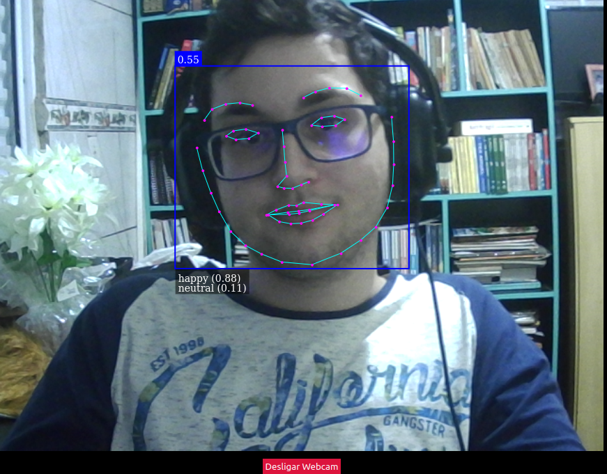

# detector face

este projeto é um pequeno website que pega a webcam pessoal do usuário e utiliza do video dela para detectar a face do usuário e mostrar seu resultado para ele.

o projeto foi construido utilizando face-api.js e React.js

para utilizar basta copiar para uma pasta, rodar npm install e npm run start.

